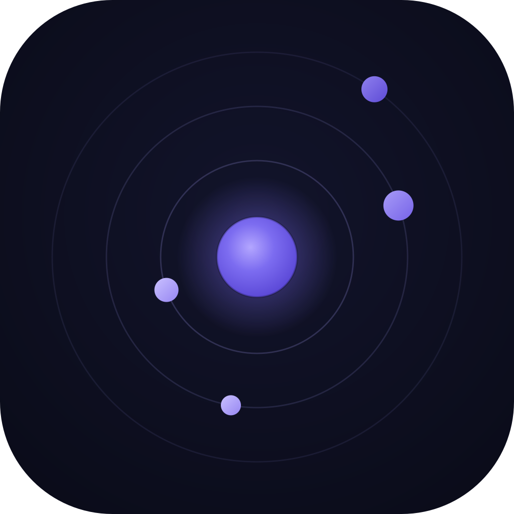

# OpenOrbit



A desktop app that runs a team of AI agents on your own machine — a central orchestrator
that delegates to specialist sub-agents, each with its own tools, connected to your files,
apps, and Google account.

> **This is a personal side project — built evenings and weekends, around a full-time job.
> No support, no roadmap commitments, no guarantees.**
>
> The app is built and works. There are no packaged downloads yet, so running it means
> [building from source](#build-and-run). Dates aren't promised.

<!-- TODO: screenshot / GIF of the orbit UI goes here -->

## How it works

Instead of one chatbot, you get a roster of agents visualized as nodes orbiting a central
orchestrator. It reads your message and routes it to the right specialist — or you address
one directly by name, or from the slash-command menu.

Four specialists ship with the app:

| Agent | Handles |
| --- | --- |
| **Cipher** | Onboarding, every app setting, and creating or editing agents |
| **Atlas** | The knowledge base and any local folders you've attached |
| **Explorer** | Live web search and reading pages |
| **Chrono** | Reminders and prompt tasks — one-shot or recurring, with OS notifications |

The orchestrator itself is separate from the roster, and you name it during onboarding
(the default is "Orbit").

The roster isn't fixed. You build new agents by chatting with Cipher — describe what you
need, and it interviews you for the domain-specific facts that kind of agent can't work
without, looks up real reference material for the domain, drafts a full system prompt, and
shows you a plain-language summary before creating anything. You can also add one by hand
in Settings, and every agent's prompt stays editable afterwards.

## What agents can reach

- **Your machine** — files and folders you've explicitly granted, plus launching apps
- **The web** — live search and page fetching
- **A knowledge base** you build by dropping in documents, or by crawling a site's sitemap
- **Your Google account** — OAuth connectors for Gmail, Calendar, Drive, and Contacts
- **MCP servers** — plug in any Model Context Protocol server
- **HTTP Tools** — turn your own REST endpoints into agent tools, with typed parameters and
  an approval prompt on whichever HTTP methods you choose

MCP servers, connectors, and HTTP tool collections are attached to individual agents, not
enabled globally — each agent only gets the tools you give it.

**Document formats the knowledge base reads:** Markdown, plain text, CSV, HTML, PDF, Word
(`.docx` and legacy `.doc`), Excel (`.xlsx` and legacy `.xls`), PowerPoint (`.pptx`),
OpenDocument (`.odt`, `.ods`, `.odp`), and common code/config formats including JSON, XML,
YAML, TOML, SQL and a range of source files.

## Other things it does

- Agent nodes show live status, and you watch steps stream as an agent works
- Voice in and out — press and hold `Cmd`/`Ctrl` + `D` to dictate, and it can speak back
- A slash menu (`/`) for settings, knowledge base, chat history, token usage, launching an
  app, or directing a message at one specific agent
- Widget cards over an animated starfield: system status, token usage and cost, knowledge
  base, tasks, and weekly activity
- Per-message cost tracking, and search across your whole conversation history
- Facts you mention once are saved and shared across every agent, so you don't repeat them
- Guided tour on first run that walks through the whole interface

## Build and run

There are no prebuilt binaries yet. You'll need [Node.js](https://nodejs.org) `^20.19.0`
or `>=22.12.0` (what Vite 7 and electron-vite 5 require) and Git.

```bash
git clone -b develop https://github.com/maneja81/OpenOrbit.git
cd OpenOrbit
npm install
npm run dev
```

Other scripts:

```bash
npm run build     # type-check and build main, preload, and renderer
npm run package   # build, then run electron-builder for your current platform
npm test          # vitest
npm run lint      # eslint
```

On first run you'll be asked to name the orchestrator, introduce yourself, and enter an
API key. Nothing else is required — there are no environment variables to set.

`npm run package` uses electron-builder's defaults with no configuration file, so treat it
as a starting point rather than a finished cross-platform pipeline.

## Bring your own key

OpenOrbit talks to any OpenAI-compatible API. OpenAI is the default; OpenRouter and
Ollama's OpenAI-compatible surface both work by changing the base URL in Settings. Chat and
voice are configured separately, so you can point them at different providers or run one
locally.

The Google connectors need you to register your own OAuth client and paste the client ID
and secret into Settings once — they're shared across all four Google connectors.

## Everything stays local

Chat history, memory, knowledge, and tasks live in a SQLite database in the app's own data
directory on your machine. There's no OpenOrbit account, no telemetry, and no server in the
middle — the only outbound traffic is to the API provider you configured, the connectors
you connected, and the tools you gave your agents.

Some deliberate hardening, and its limits:

- The renderer runs with `contextIsolation` on, `nodeIntegration` off, and `sandbox` on,
  behind a CSP with `connect-src 'none'` — it makes no network requests of its own; every
  API call, tool run, and connector lives in the main process.
- Remote images in replies aren't fetched until you click to load them (the default, and a
  setting), so a prompt-injected tracking URL never fires on its own.
- User-authored HTTP tools are checked against loopback, private, and link-local addresses,
  including after DNS resolution to catch rebinding. Private hosts are opt-in per collection.
- Agents only reach folders you've explicitly granted.
- API keys, connector credentials, and MCP env vars are encrypted at rest with AES-256-GCM
  — but the key is stored in the same SQLite database. That's obfuscation against casual
  inspection, **not** protection against anyone with access to your machine's files. It's a
  deliberate tradeoff, and worth knowing before you point this at anything sensitive.

## Stack

TypeScript throughout, strict mode, ESM.

| Layer | Choice |
| --- | --- |
| Shell | Electron 43 |
| Build | electron-vite 5 + Vite 7 |
| Renderer | React 19, framer-motion, react-markdown, driver.js |
| Orchestration | OpenAI Agents SDK (`@openai/agents`) |
| Persistence | better-sqlite3 (WAL) |
| Validation | zod 4 |
| Test | vitest 4 + Testing Library |
| Packaging | electron-builder |

## How it's built

**Every line of OpenOrbit is written by [Claude Code](https://claude.com/claude-code).**
Not "AI-assisted" — there are no hand-written commits. The scaffold, every feature, the
tests, the refactors, and the development process around it all came out of an agentic
workflow, and that hasn't been relaxed for the hard parts.

It runs as a repeatable loop rather than ad-hoc prompting: purpose-built skills and
workflows take a feature from spec to implementation, validate it, raise the PR, run the
review cycle, and merge.

That's partly the point. Building an agent orchestrator *through* an agentic workflow is a
direct way to find out where these tools genuinely hold up and where they don't — and
whatever that turns up feeds back into OpenOrbit's own design.

## Following along

[Discussions](https://github.com/maneja81/OpenOrbit/discussions) is the place to talk about
it. I read everything that gets posted, but replies land when they land — often a few days.

Development happens on `develop`. `main` tracks stable.

## License

MIT — see [LICENSE](LICENSE).
