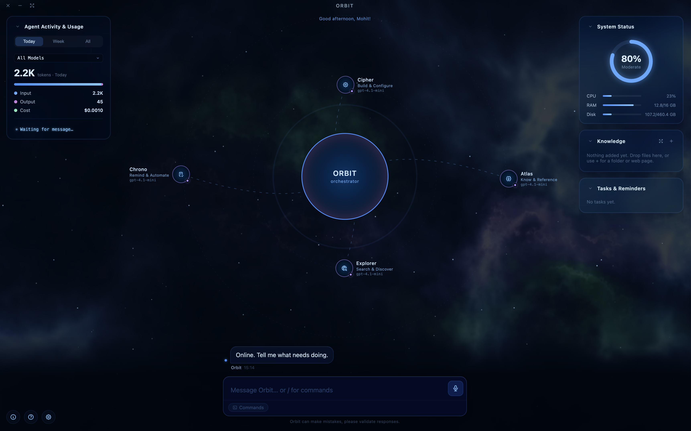

# OpenOrbit

[](https://github.com/maneja81/OpenOrbit/actions/workflows/ci.yml)


A desktop app that runs a team of AI agents on your own machine — a central orchestrator
that delegates to specialist sub-agents, each with its own tools, connected to your files,
apps, and Google account.

> **This is a personal side project — built evenings and weekends, around a full-time job.
> No support, no roadmap commitments, no guarantees.**
>
> The app works. Grab a packaged build from the
> [latest release](https://github.com/maneja81/OpenOrbit/releases/latest), or
> [build from source](#build-and-run). Dates aren't promised.



## How it works

Instead of one chatbot, you get a roster of agents visualized as nodes orbiting a central
orchestrator. It reads your message and routes it to the right specialist — or you address
one directly by name, or from the slash-command menu.

Four specialists ship with the app:

| Agent | Handles |
| --- | --- |
| **Cipher** | Onboarding, every app setting, and creating or editing agents |
| **Atlas** | The knowledge base and any local folders you've attached |
| **Explorer** | Live web search and reading pages |
| **Chrono** | Reminders and prompt tasks — one-shot or recurring, with OS notifications |

The orchestrator itself is separate from the roster, and you name it during onboarding
(the default is "Orbit").

The roster isn't fixed. You build new agents by chatting with Cipher — describe what you
need, and it interviews you for the domain-specific facts that kind of agent can't work
without, looks up real reference material for the domain, drafts a full system prompt, and
shows you a plain-language summary before creating anything. You can also add one by hand
in Settings, and every agent's prompt stays editable afterwards.

Settings work the same way — ask Cipher to turn on voice output or rename the orchestrator,
and it makes the change directly rather than walking you to the right screen. A few settings
are off-limits from chat entirely — the approval policy, provider URLs, and location access
among them — precisely because a chat-driven change is the thing they exist to guard against.
Rewriting an existing agent's prompt or attaching a connector to it pauses for your
confirmation first, since either one persists past the conversation that requested it.

## What agents can reach

- **Your machine** — files and folders you've explicitly granted, plus launching apps
- **The web** — live search and page fetching
- **A knowledge base** you build by dropping in documents, or by crawling a site's sitemap
- **Your Google account** — OAuth connectors for Gmail, Calendar, Drive, and Contacts
- **MCP servers** — plug in any Model Context Protocol server
- **HTTP Tools** — turn your own REST endpoints into agent tools, with typed parameters and
  an approval prompt on whichever HTTP methods you choose

MCP servers, connectors, and HTTP tool collections are attached to individual agents, not
enabled globally — each agent only gets the tools you give it.

**Document formats the knowledge base reads:** Markdown, plain text, CSV, HTML, PDF, Word
(`.docx` and legacy `.doc`), Excel (`.xlsx` and legacy `.xls`), PowerPoint (`.pptx`),
OpenDocument (`.odt`, `.ods`, `.odp`), and common code/config formats including JSON, XML,
YAML, TOML, SQL and a range of source files.

## Other things it does

- Agent nodes show live status, and you watch steps stream as an agent works
- Voice in and out — press and hold `Cmd`/`Ctrl` + `D` to dictate, and it can speak back
- A slash menu (`/`) for settings, knowledge base, chat history, token usage, launching an
  app, or directing a message at one specific agent
- Widget cards over an animated starfield: system status, token usage and cost, knowledge
  base, tasks, and weekly activity
- Per-message cost tracking, and search across your whole conversation history
- Facts you mention once are saved and shared across every agent, so you don't repeat them
- Guided tour on first run that walks through the whole interface

## Build and run

Packaged builds for macOS, Windows and Linux are on the
[releases page](https://github.com/maneja81/OpenOrbit/releases). To build from source
you'll need [Node.js](https://nodejs.org) `^20.19.0` or `>=22.12.0` (what Vite 7 and
electron-vite 5 require) and Git.

```bash
git clone -b develop https://github.com/maneja81/OpenOrbit.git
cd OpenOrbit
npm install
npm run dev
```

Other scripts:

```bash
npm run build     # type-check and build main, preload, and renderer
npm run package   # build, then run electron-builder for your current platform
npm test          # vitest
npm run lint      # eslint
```

On first run you'll be asked to name the orchestrator, introduce yourself, and enter an
API key. Nothing else is required — there are no environment variables to set.

## End-to-end tests

`e2e/` holds Playwright specs that drive the real Electron app — currently onboarding, with
more feature/setting coverage planned. Two ways to run them:

```bash
npm run test:e2e         # isolated: throwaway worktree, own install/build, markdown report
npm run test:e2e:local   # fast: runs against this checkout's existing dist-electron build
```

`npm run test:e2e` never touches this checkout or your real
`~/Library/Application Support/OpenOrbit` database — it creates a detached worktree from the
current branch, copies in `.env.test`, installs and builds there, runs the suite against a
sandboxed `--user-data-dir`, writes a report to `e2e/reports/<run-id>/report.md` in this
checkout, and removes the throwaway worktree whether the run passed or failed. `npm install`
is skipped on a cache hit (keyed on `package-lock.json`), so repeat runs are fast.

Create a `.env.test` (gitignored, same shape as `.env`) with whichever provider keys the
specs need — at minimum `OPENAI_API_KEY`. Which provider a spec authenticates against is
controlled by `E2E_PROVIDER` (`openai` by default, or `openrouter` to use a cheaper model and
avoid OpenAI billing on every run); an unset or missing key for the selected provider fails
the run loudly rather than skipping quietly. `local` is not selectable — the harness doesn't
provision an Ollama server.

`npm run package` builds for your current platform only, using the `build` config in
`package.json` (macOS `.dmg`, Windows `.exe` via NSIS, Linux `.AppImage`). Cross-platform
builds happen in CI — see `.github/workflows/release.yml`, which builds all three and
attaches them to a GitHub Release on every `v*` tag.

## Bring your own key

OpenOrbit talks to any OpenAI-compatible API. OpenAI is the default; OpenRouter and
Ollama's OpenAI-compatible surface both work by changing the base URL in Settings. Chat and
voice are configured separately, so you can point them at different providers or run one
locally.

The Google connectors need you to register your own OAuth client and paste the client ID
and secret into Settings once — they're shared across all four Google connectors.

## Everything stays local

Chat history, memory, knowledge, and tasks live in a SQLite database in the app's own data
directory on your machine. There's no OpenOrbit account, no telemetry, and no server in the
middle — the only outbound traffic is to the API provider you configured, the connectors
you connected, and the tools you gave your agents.

Some deliberate hardening, and its limits:

- The renderer runs with `contextIsolation` on, `nodeIntegration` off, and `sandbox` on,
  behind a CSP with `connect-src 'none'` — it makes no network requests of its own; every
  API call, tool run, and connector lives in the main process.
- Remote images in replies aren't fetched until you click to load them (the default, and a
  setting), so a prompt-injected tracking URL never fires on its own.
- User-authored HTTP tools are checked against loopback, private, and link-local addresses,
  including after DNS resolution to catch rebinding, and the check still holds across a
  redirect. Private hosts are opt-in per collection.
- Agents only reach folders you've explicitly granted.
- Rewriting an agent's prompt, attaching a connector to it, or creating a recurring prompt task
  pauses for your approval — the same gate HTTP tool calls already go through. Renaming an
  agent or picking a different model doesn't ask, since neither leaves anything running after
  the conversation ends.
- API keys, connector credentials, and MCP env vars are encrypted at rest with AES-256-GCM
  — but the key is stored in the same SQLite database. That's obfuscation against casual
  inspection, **not** protection against anyone with access to your machine's files. It's a
  deliberate tradeoff, and worth knowing before you point this at anything sensitive.

## Stack

TypeScript throughout, strict mode, ESM.

| Layer | Choice |
| --- | --- |
| Shell | Electron 43 |
| Build | electron-vite 5 + Vite 7 |
| Renderer | React 19, framer-motion, react-markdown, driver.js |
| Orchestration | OpenAI Agents SDK (`@openai/agents`) |
| Persistence | better-sqlite3 (WAL) |
| Validation | zod 4 |
| Test | vitest 4 + Testing Library |
| Packaging | electron-builder |

## How it's built

**Every line of OpenOrbit is written by [Claude Code](https://claude.com/claude-code).**
Not "AI-assisted" — there are no hand-written commits. The scaffold, every feature, the
tests, the refactors, and the development process around it all came out of an agentic
workflow, and that hasn't been relaxed for the hard parts.

It runs as a repeatable loop rather than ad-hoc prompting: purpose-built skills and
workflows take a feature from spec to implementation, validate it, raise the PR, run the
review cycle, and merge.

That's partly the point. Building an agent orchestrator *through* an agentic workflow is a
direct way to find out where these tools genuinely hold up and where they don't — and
whatever that turns up feeds back into OpenOrbit's own design.

## Following along

[Discussions](https://github.com/maneja81/OpenOrbit/discussions) is the place to talk about
it. I read everything that gets posted, but replies land when they land — often a few days.

Development happens on `develop`. `main` tracks stable. What's changed is in
[CHANGELOG.md](CHANGELOG.md).

## License

MIT — see [LICENSE](LICENSE).
